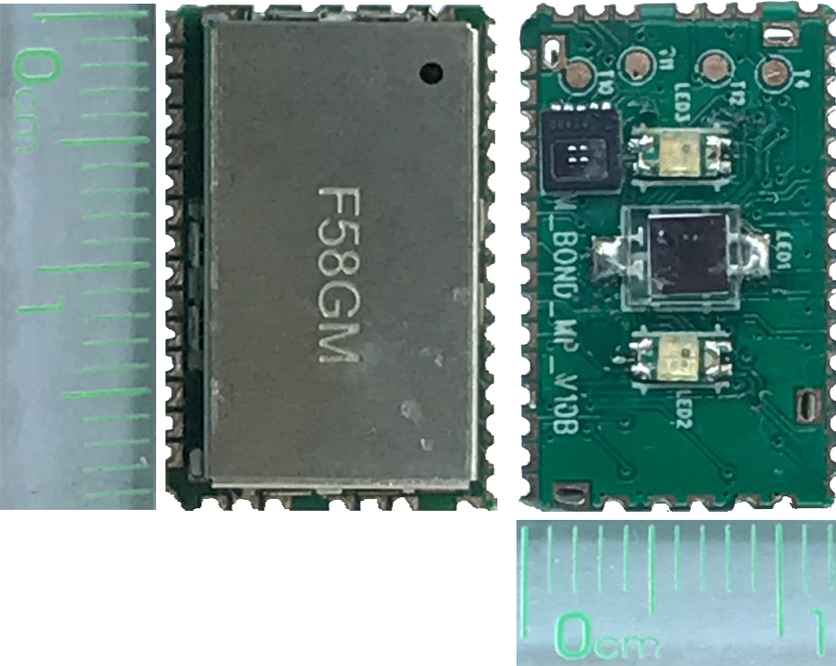
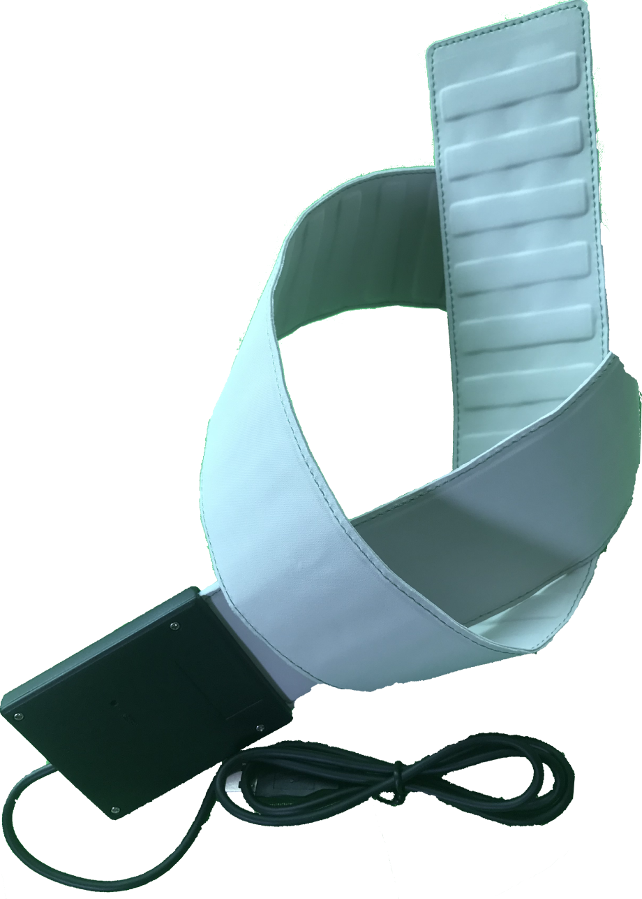
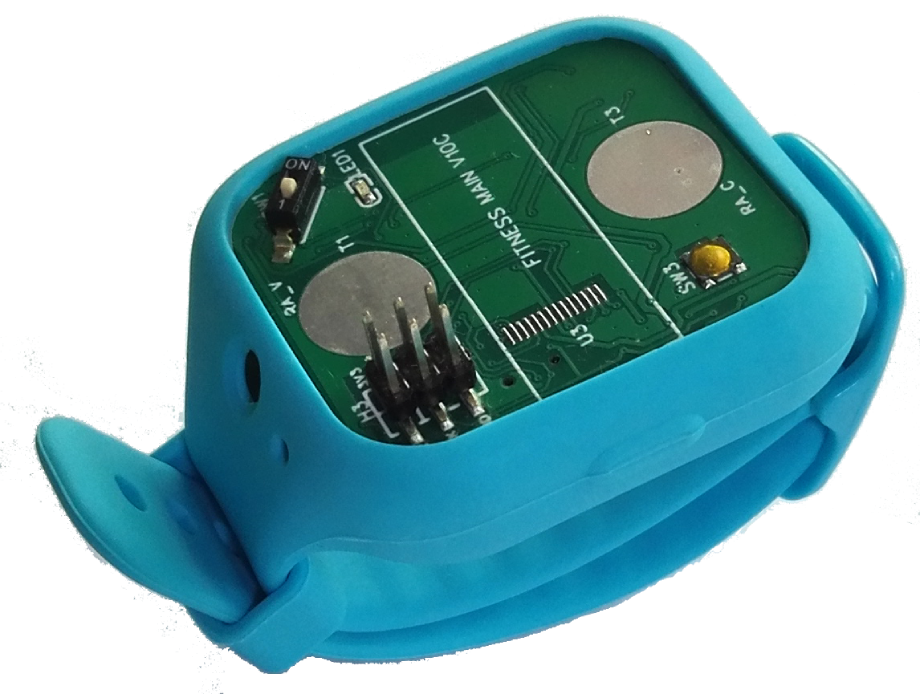
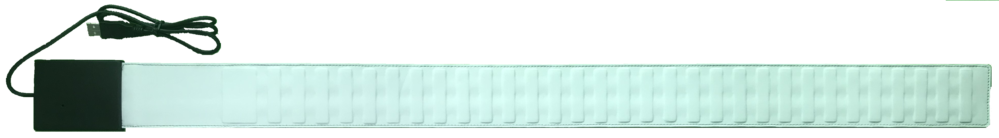
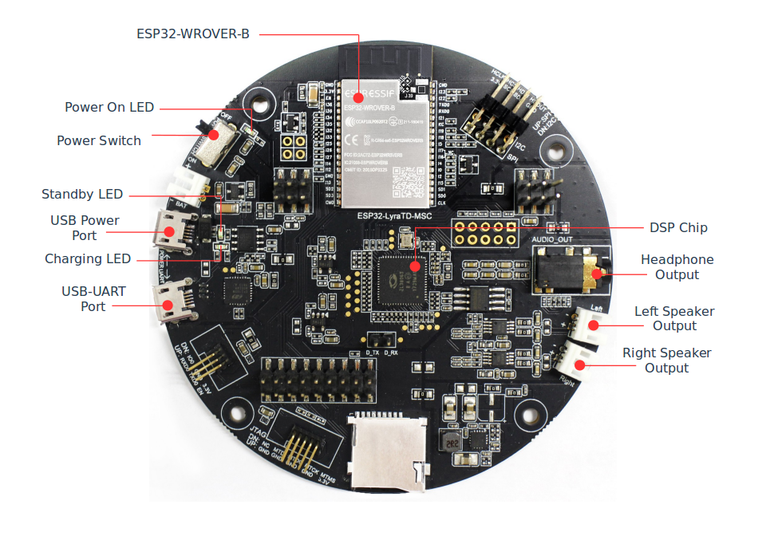

# BioSensor Healthcare Development Framework


BioSensor Healthcare Development Framework (BIO-HDF) is the development framework for health applications with BioSensor-F58GM,Currently only supported [ESP32](https://espressif.com/en/products/hardware/esp32/overview) chip.

## A completed BioSensor project including software and hardware solutions; also depending on the following projects:

PC Evaluation Tool using LabWindows CVI :
[https://github.com/feelkit/bioDemo_labwindows_cvi](https://github.com/feelkit/bioDemo_labwindows_cvi)

Andorid BioSensor project: [https://github.com/feelkit/biosensor-android](https://github.com/feelkit/biosensor-android)

## Overview

BIO-HDF supports development of health applications used the Biosensor module:F58GM,Currently only for the Espressif Systems [ESP32](https://espressif.com/en/products/hardware/esp32/overview) chip in the most comprehensive way. We will support more chips in the future.With the BIO-HDF, you can easily add features, develop health applications from simple to complex:

- To measure and analysis various types of bio-data such as ECG,BCG,EEG,RESP,GSR,HR,PPG,Spo2,HCM,BIA and Temperature ...
- For wristband devices,supported ECG,RESP,HR,Spo2,BIA,HCM,Temperature and Weight ...
- About contactless vital sign sensor such as sleep monitoring strip under mattress, supported RESP,HR,Sleep,HRV ...
- Other Fitness devices,Mobile health devices and robots ...

## Developing with the BIO-HDF

### Quick Start

You need [stable version of ESP-IDF](https://docs.espressif.com/projects/esp-idf/en/stable/versions.html) to provide the toolchain, the Biosensor demo board.

**Note:**  If this is your first exposure to ESP32 and ESP-IDF, proceed to [Getting Started](https://docs.espressif.com/projects/esp-idf/en/stable/get-started/index.html) documentation.

Clone the BIO-HDF repository, set up `HDF_PATH`, and then compile, flash and monitor applications in the same way as when working with ESP-IDF.

```
git clone --recursive https://github.com/feelkit/bio-hdf.git

```
Linux and macOS
```
cd ~/esp
cp -r $HDF_PATH/examples/get-started/hello_world .
```
Windows
```
cd %userprofile%\esp
xcopy /e /i %HDF_PATH%\examples\get-started\hello_world hello_world
```
If you clone project without `--recursive` flag, please goto the `bio-hdf` directory and run command `git submodule update --init` before doing anything.

### Hardware
The BioSensor-F58GM is a health module; it measures and transfers various types of bio-data such as ECG,BCG,EEG,RESP,GSR,HR,PPG,Spo2,HCM,BIA and Temperature ... , integrated Bio-Processor with Analog Front-End to make an all-in-one health monitoring solution. 

We have released a number of boards for BIO-HDF to develop healthcare applications with BioSensor-F58GM , including:

| BioSensor Module F58GM | PIEZO-ESP32-F58GM Sleep Monitoring Strip | WRISTBAND-ESP32-F58GM Development Board |
|:----:|:----:|:----:|
|  [](https://github.com/feelkit/bio-hdf/blob/master/docs/F58GM_V20C_EN.pdf)  |  [](https://github.com/feelkit/sleep-monitor)  |  [](https://github.com/feelkit/bio-hdf)  |
|  [Getting Started with BioSensor-F58GM](https://github.com/feelkit/bio-hdf/blob/master/docs/F58GM_V20C_EN.pdf)  |  [Getting Started with Sleep monitoring strip](https://github.com/feelkit/sleep-monitor)  |  [Coming soon](https://github.com/feelkit/bio-hdf)  |

#### BioSensor-F58GM

- F58GM supports 8 electrodes to achieve applications with human electrical activities and impedance activities;

- Specially, for some common healthcare applications, BioSensor supports direct adaptation of these sensors, such as body temperature, weight, piezoelectric and so on.

- Optional,F58GM integrates red (660 nm), green (520 nm) and infrared (940 nm) three-color LED and photodiode(PD) sensor to realize PPG-related applications. 

- Optional, F58GM integrates Infrared thermopile for contactless medical temperature measurement, and the accuracy reaches ± 0.2 ℃ near 37 ℃.

- F58GM integrates MCU/DSP with biological analog front end and 24 bit ADC , hardware interface supports SPI/I2C/UART optional.

#### Sleep monitoring strip
An open-source development board, supporting Espressif Systems’ ADF and featuring voice wake-up, a wake-up button and an audio player. Designed for smart speakers and smart-home applications.

[<div align="center"></div>](https://github.com/feelkit/sleep-monitor)

* [Getting Started with ESP32-LyraT](https://docs.espressif.com/projects/esp-adf/en/latest/get-started/get-started-esp32-lyrat.html)
* [ESP32-LyraT V4.3 Hardware Reference](https://docs.espressif.com/projects/esp-adf/en/latest/design-guide/board-esp32-lyrat-v4.3.html)
* [ESP32-LyraT Schematic (PDF)](https://dl.espressif.com/dl/schematics/esp32-lyrat-v4.3-schematic.pdf)

#### Wristband Development Board

Designed for smart speakers and AI applications. Supports Acoustic Echo Cancellation (AEC), Automatic Speech Recognition (ASR), Wake-up Interrupt and Voice Interaction.

[<div align="center"></div>](https://docs.espressif.com/projects/esp-adf/en/latest/get-started/get-started-esp32-lyratd-msc.html)

* [Getting Started with ESP32-LyraTD-MSC](https://docs.espressif.com/projects/esp-adf/en/latest/get-started/get-started-esp32-lyratd-msc.html)
* [ESP32-LyraTD-MSC Schematic Lower Board A (PDF) ](https://dl.espressif.com/dl/schematics/ESP32-LyraTD-MSC_A_V2_2-1109A.pdf), [Upper Board B (PDF)](https://dl.espressif.com/dl/schematics/ESP32-LyraTD-MSC_B_V1_1-1109A.pdf)

#### Wristband Development Board

An open-source mono development board. Designed for connected smart speakers and smart-home audio applications.

Coming soon...

#### Examples

Check folder [examples](examples) that contains sample applications to demonstrate API features of the ESP-ADF.

# Resources

* [Documentation](https://docs.espressif.com/projects/esp-adf/en/latest/index.html) for the latest version of https://docs.espressif.com/projects/esp-adf/. This documentation is built from the [docs directory](docs) of this repository.
* The [esp32.com forum](https://esp32.com/) is a place to ask questions and find community resources. On the forum there is a [section dedicated to ESP-ADF](https://esp32.com/viewforum.php?f=20) users.
* [Check the Issues section on github](https://github.com/espressif/esp-adf/issues) if you find a bug or have a feature request. Please check existing Issues before opening a new one.
* If you're interested in contributing to ESP-ADF, please check the [Contributions Guide](https://esp-idf.readthedocs.io/en/latest/contribute/index.html).
