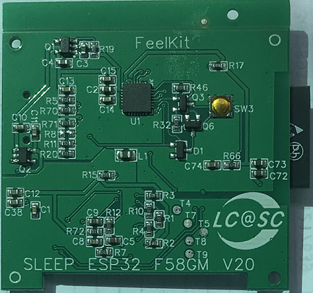

# BioSensor Healthcare Development Framework


BioSensor Healthcare Development Framework (BIO-HDF) is the development framework for health applications with BioSensor-F58GM,Currently only supported [ESP32](https://espressif.com/en/products/hardware/esp32/overview) chip.

## A completed BioSensor project including software and hardware solutions; also depending on the following projects:

PC Evaluation Tool using LabWindows CVI :
[https://github.com/feelkit/bioDemo_labwindows_cvi](https://github.com/feelkit/bioDemo_labwindows_cvi)

Andorid BioSensor project: [https://github.com/feelkit/biosensor-android](https://github.com/feelkit/biosensor-android)

## Overview

BIO-HDF supports development of health applications used the Biosensor module:F58GM,Currently only for the Espressif Systems [ESP32](https://espressif.com/en/products/hardware/esp32/overview) chip in the most comprehensive way. We will support more chips in the future.With the BIO-HDF, you can easily add features, develop health applications from simple to complex:

- To measure and analysis various types of bio-data such as ECG,BCG,EEG,RESP,GSR,HR,PPG,Spo2,HCM,BIA and Temperature ...
- For wristband devices,supported ECG,RESP,HR,Spo2,BIA,HCM,Temperature and Weight ...
- About contactless vital sign sensor such as sleep monitoring strip under mattress, supported RESP,HR,Sleep,HRV ...
- Other Fitness devices,Mobile health devices and robots ...

## Developing with the BIO-HDF

### Quick Start

You need [stable version of ESP-IDF](https://docs.espressif.com/projects/esp-idf/en/stable/versions.html) to provide the toolchain, the Biosensor demo board.

**Note:**  If this is your first exposure to ESP32 and ESP-IDF, proceed to [Getting Started](https://docs.espressif.com/projects/esp-idf/en/stable/get-started/index.html) documentation.

Clone the BIO-HDF repository, set up `HDF_PATH`, and then compile, flash and monitor applications in the same way as when working with ESP-IDF.

```
git clone --recursive https://github.com/feelkit/bio-hdf.git

```
Linux and macOS
```
cd ~/esp
cp -r $HDF_PATH/examples/get-started/hello_world .
```
Windows
```
cd %userprofile%\esp
xcopy /e /i %HDF_PATH%\examples\get-started\hello_world hello_world
```
If you clone project without `--recursive` flag, please goto the `bio-hdf` directory and run command `git submodule update --init` before doing anything.

### Hardware
The BioSensor-F58GM is a health module; 

it measures and transfers various types of bio-data such as ECG, BCG, EEG, RESP, GSR, HR, PPG, Spo2, HCM, BIA and Temperature ... , integrated Bio-Processor with Analog Front-End to make an all-in-one health monitoring solution. 

We have released a number of boards for BIO-HDF to develop healthcare applications with BioSensor-F58GM , including:

| BioSensor Module F58GM | PIEZO-ESP32-F58GM Sleep Monitoring Strip | WRISTBAND-ESP32-F58GM Development Board |
|:----:|:----:|:----:|
|  [](https://github.com/feelkit/bio-hdf/blob/master/docs/F58GM_V20C_EN.pdf)  |  [](https://bio-hdf-docs.readthedocs.io)  |  [](https://github.com/feelkit/bio-hdf)  |
|  [Getting Started with BioSensor-F58GM](https://github.com/feelkit/bio-hdf/blob/master/docs/F58GM_V20C_EN.pdf)  |  [Getting Started with Sleep monitoring strip](https://bio-hdf-docs.readthedocs.io)  |  [Coming soon](https://github.com/feelkit/bio-hdf)  |

#### BioSensor-F58GM

- F58GM supports 8 electrodes to achieve applications with human electrical activities and impedance activities;

- Specially, for some common healthcare applications, BioSensor supports direct adaptation of these sensors, such as body temperature, weight, piezoelectric and so on.

- Optional,F58GM integrates red (660 nm), green (520 nm) and infrared (940 nm) three-color LED and photodiode(PD) sensor to realize PPG-related applications. 

- Optional, F58GM integrates Infrared thermopile for contactless medical temperature measurement, and the accuracy reaches ± 0.2 ℃ near 37 ℃.

- F58GM integrates MCU/DSP with biological analog front end and 24 bit ADC , hardware interface supports SPI/I2C/UART optional.

#### Sleep monitoring strip
An open-source development board, supporting BIO-HDF and featuring contactless HR, RESP,Sleep,HRV and ...; Designed for contactless sleep monitoring applications.

[<div align="center"></div>](https://bio-hdf-docs.readthedocs.io)

* [Getting Started with Sleep Strip](https://bio-hdf-docs.readthedocs.io/)
* [Sleep Strip Hardware Reference](https://lceda.cn/seanfan/piezo_f58gm_esp32)

* Sleep Strip PCBA Top:
[<div align="center"></div>](https://lceda.cn/seanfan/piezo_f58gm_esp32)
* Sleep Strip PCBA Bottom:
[<div align="center"></div>](https://lceda.cn/seanfan/piezo_f58gm_esp32)

#### Wristband Development Board

An open-source mono development board. Designed for Smart Wearale healthcare applications.

Coming soon...

#### Examples

Check folder [examples](examples) that contains sample applications to demonstrate API features of the BIO-HDF.

# Resources
* BioSensor-F58GM Specs：[F58GM_V20C_EN.pdf](docs/F58GM_V20C_EN.pdf)
* Sleep Monitoring Strip Hardware Reference( Sch & Pcb )：[https://lceda.cn/seanfan/piezo_f58gm_esp32](https://lceda.cn/seanfan/piezo_f58gm_esp32)
* [Documentation](https://bio-hdf-docs.readthedocs.io/en/latest/index.html) for the latest version of https://github.com/feelkit/bio-hdf-docs/ . This documentation is built from the [docs directory](docs) of this repository.


# Contact
If you have technical problems and ideas to communicate with us, you can
contact us by Email: fanfeiwu@gmail.com, QQ: 4646079

For more information,please browse our homepage: [www.feelkit.com](http://www.feelkit.com).
