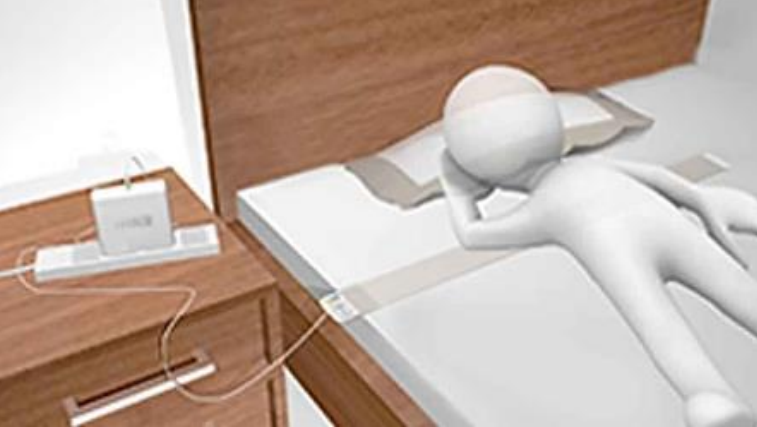
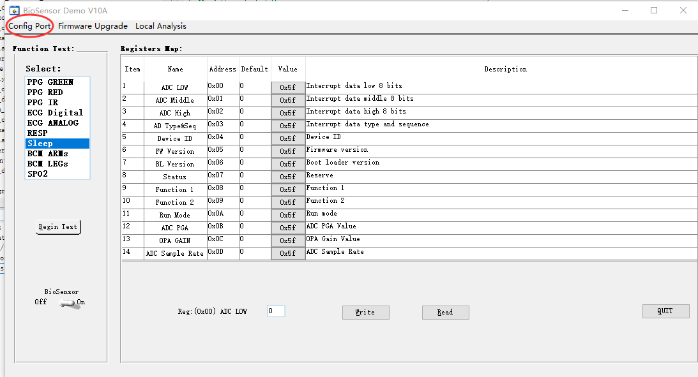
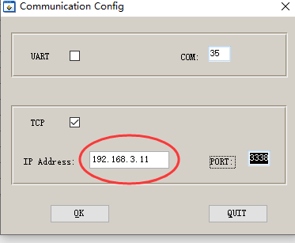
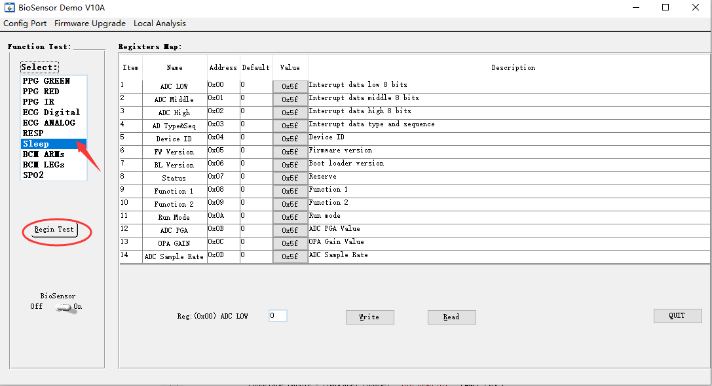
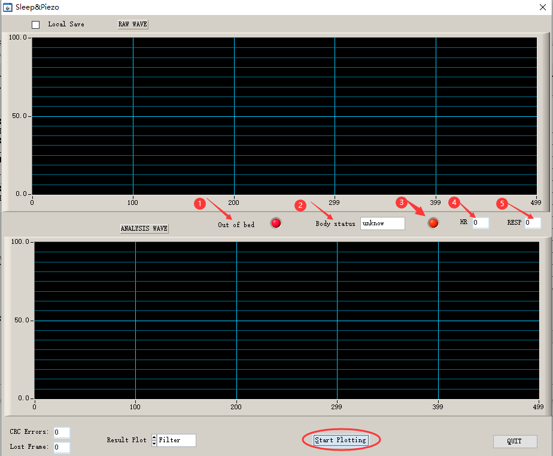

ESP32-Sleep-Monitoring-Strip Getting Started Guide
======================================

This guide provides users with functional descriptions, configuration options for ESP32-Sleep-Monitoring-Strip development board, as well as how to get started with the ESP32-Sleep-Monitoring-Strip.

The ESP32-Sleep-Monitoring-Strip development board is a hardware platform designed for the dual-core ESP32 healthcare applications with BioSensor-F58GM, e.g., tracking HR, RESP, Sleep,In/out Bed etc.

If you like to start using this board right now, go directly to section :ref:`get-started-esp32-sleep-strip-start-development`.

What You Need
-------------

* 1 × :ref:`ESP32 Sleep Monitoring Strip <get-started-esp32-sleep-strip-v01>`
* 1 x Power Bank with USB Type-A Female
* 1 x Android phone/PAD with Bluetooth BLE and WIFI
* 1 × PC loaded with Windows

Overview
^^^^^^^^

The ESP32-Sleep-Monitoring-Strip is a healthcare development board built around BioSensor-F58GM and ESP32. The following functions are supported: 

* Tracking HR,RESP,Sleep,In/out bed ...
* Analysis about HRV and OSAHS
* Run as strip sensor under mattress
* Non-contact, even without any assistance

The block diagram below presents main components of the ESP32-Sleep-Monitoring-Strip and interconnections between components.

.. figure:: ../../_static/sleep_strip/sleep_strip_block.png
    :alt: ESP32 Sleep Strip block diagram
    :figclass: align-center

    ESP32-Sleep-Monitoring-Strip Block Diagram

Functional Description
^^^^^^^^^^^^^^^^^^^^^^

The following list and figure describe key components, interfaces and controls of the ESP32-Sleep-Strip board.

ESP32-WROOM  Module
    The ESP32-WROOM module contains ESP32 chip to provide Wi-Fi / BT connectivity and data processing.
Green,Blue and Red LEDs
    Three general purpose LEDs controlled by **ESP32-WROOM Module** to indicate certain operation states of the healthcare application using dedicated API.
MicroSD Card
    The development board supports a MicroSD card in 1-bit modes, and can store healthcare data in the MicroSD card. 
USB-UART and Power Port
    Functions as the communication interface between a PC and the ESP32 module,and provides the power supply for the board..
Boot Press Keys
    Boot: holding down the **Reset** button and meantime plug in the USB power supply(eg: Power Bank) initiates the firmware upload mode. Then user can upload firmware through the serial port. Reset: re-plug in the USB power supply,while not pressing the **Reset** button.

.. _get-started-esp32-sleep-strip-v01:

.. figure:: ../../_static/sleep_strip/sleep_strip_pcba_top.png
    :alt: ESP32 Sleep Strip board layout Top
    :figclass: align-center

    ESP32 Sleep Strip board layout Top

.. figure:: ../../_static/sleep_strip/sleep_strip_pcba_bot.png
    :alt: ESP32 Sleep Strip board layout Bottom
    :figclass: align-center

    ESP32 Sleep Strip board layout Bottom

.. _get-started-esp32-sleep_strip-setup-options:

Hardware Setup Options
^^^^^^^^^^^^^^^^^^^^^^

* For the ESP32-Sleep-Strip,it is very easy; Just pluging the USB connector into the PC or power bank, and it will work.

* For the runnig scene about the sleep-strip, please refer to the the folpowing figure. **Tip：** Even if the sleep-strip is placed under a mattress, it can work normally.

    Using the ESP32-Sleep-Strip

Software Setup Options
^^^^^^^^^^^^^^^^^^^^^^

Generally,the ESP32-Sleep-Strip need to be connected to a PC or mobile phone by BLE&WIFI in order to test; Even it can acess to Cloud services by WIFI.
Currently,for PC Software Development Kit please refer to `the demo kit about LabWindows CVI-2017 <https://github.com/feelkit/bioDemo_labwindows_cvi>`_;
For mobile application we are working hard to develop `the Android APP <https://github.com/feelkit/biosensor-android>`_;This project has not been completed, we are still updating frequently.
If you want to acess to your Cloud services, you may need to do the work yourself. Of course, we can provide technical support. In a word, you can contact me (fanfeiwu@gmail.com)  if you have any technical question. We are professional in healthcare.

Connecting to PC by WIFI
""""""""""""""""""""""""""""""""""
1. Install the PC program from `the demo kit about LabWindows CVI-2017 <https://github.com/feelkit/bioDemo_labwindows_cvi>`_

* Clone the repository: ::

 git clone --recursive https://github.com/feelkit/bioDemo_labwindows_cvi

* Run the **setup.exe** located: ::

 %project-root%/bioDemo_labwindows_cvi/cvidistkit.BioSensor_cvi/Volume

2. Install `the Android APK <https://github.com/feelkit/biosensor-android/blob/master/biosensor.apk>`_ (biosensor-android/biosensor.apk)

* Download **biosensor.apk** by cloning the repository: ::

 git clone --recursive https://github.com/feelkit/biosensor-android

3. Config WIFI for the ESP32-Sleep-Monitoring-Strip in order to get the sleep-strip's IP address assigned by your router.

* First,pluging the sleep-strip's USB connector into the PC or power bank;

* Run the **biosensor.apk** in Android Phone；**Note：** Turn on Bluetooth in the phone settings menu；If it's normal,the following view will be displayed:

.. figure:: ../../_static/android/android_start.png
    :alt: biosensor android start
    :figclass: align-center

    biosensor android start    
    
* Click **CONFIG WIFI** button;The input box as shown in the following figure will be displayed;Then please input SSID&PWD(Format:**XXXXXXX xxxxxxxxx**);**Note：** Separate SSID and PWD with spaces ,and SSID can't contain spaces.

.. figure:: ../../_static/android/android_input.png
    :alt: Input WIFI SSID PWD
    :figclass: align-center

    Input WIFI SSID PWD

* Click **OK** button;If it's normal,the following figure with IP address(Format: **IP:XXX.XXX.XXX.XXX**) will be displayed:

.. figure:: ../../_static/android/android_ip.png
    :alt: Sleep Strip IP address 
    :figclass: align-center

    Sleep Strip IP address 

4. Run the PC program **Bio_cvi**，the following figure will be displayed：

    Connecting to the sleep-strip

5. Click **Config Port** button;The input box as shown in the following figure will be displayed：

    Input the sleep-strip's IP address

6. Click **OK** button to return to the following view. If it's normal,the PC should be connected to the sleep-strip now.**Note:** The PC and the sleep-strip must be in the same routing network.

    Begin to test the sleep-strip

7 . Select the list item **Sleep**,and Click **Begin Test** button to enter to the following view. 

    Plot and analyze data from  the sleep-strip

8 . Click **Start Plotting** button to Plot and analyze data from  the sleep-strip. 

* There are two areas of waveform, one shows the raw data, the other shows the effects of filtering, enhancement, peak seeking, etc

* The mark **1** indicates whether someone is in bed.When something is placed on the sleep-strip, the indicator light will turn green, otherwise it will turn red

* The mark **2** shows the movement of the person in bed,eg : Moving,Repose and Turning over.

* The mark **3** indicates whether someone in bed is moving.When the person is moving, the indicator light will turn red, otherwise it will turn green.

* The mark **4** indicates HR of someone in bed.

* The mark **5** indicates RESP of someone in bed.

* We are still continuously optimizing our software algorithms. Next, we will add HRV analysis, diagnosis of OSAHS, sleep staging, etc

Related Documents
-----------------

* :doc:`F58GM_V20C_EN.pdf`
* `ESP32-Sleep-Monitoring-Strip schematic & PCB <https://lceda.cn/seanfan/piezo_f58gm_esp32>`_

* `ESP32 Datasheet <https://www.espressif.com/sites/default/files/documentation/esp32_datasheet_en.pdf>`_ (PDF)
* `ESP32-WROOM Datasheet <https://espressif.com/sites/default/files/documentation/esp32-wroom_datasheet_en.pdf>`_ (PDF)

