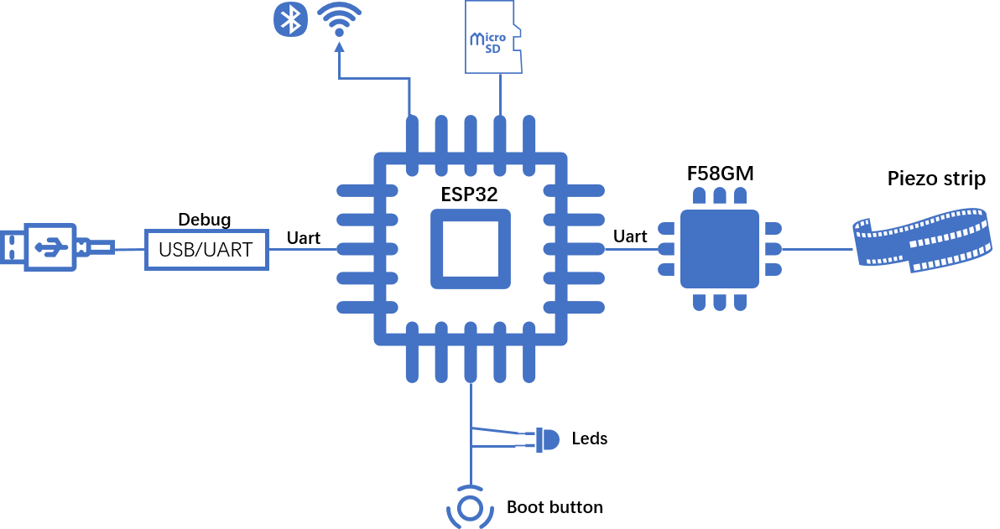
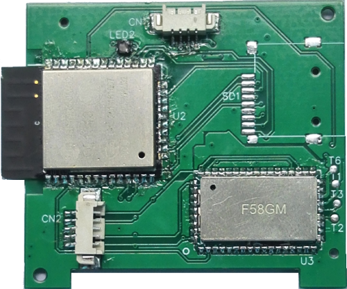
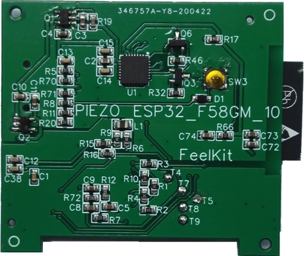

ESP32-Sleep-Monitoring-Strip Getting Started Guide
======================================

This guide provides users with functional descriptions, configuration options for ESP32-Sleep-Monitoring-Strip development board, as well as how to get started with the ESP32-Sleep-Monitoring-Strip.

The ESP32-Sleep-Monitoring-Strip development board is a hardware platform designed for the dual-core ESP32 healthcare applications with BioSensor-F58GM, e.g., tracking HR, RESP, Sleep,In/out Bed etc.

If you like to start using this board right now, go directly to section :ref:`get-started-esp32-sleep-strip-start-development`.

What You Need
-------------

* 1 × :ref:`ESP32 Sleep Monitoring Strip <get-started-esp32-sleep-strip-v01>`
* 1 x Power Bank with USB Type-A Female
* 1 x Android phone/PAD with Bluetooth BLE and WIFI
* 1 × PC loaded with Windows

Overview
^^^^^^^^

The ESP32-Sleep-Monitoring-Strip is a healthcare development board built around BioSensor-F58GMESP32. 
* Tracking HR,RESP,Sleep,In/out bed ...
* Analysis about HRV and OSAHS
* Run as strip sensor under mattress
* Non-contact, even without any assistance

The block diagram below presents main components of the ESP32-Sleep-Monitoring-Strip and interconnections between components.

    ESP32-Sleep-Monitoring-Strip Block Diagram

Functional Description
^^^^^^^^^^^^^^^^^^^^^^

The following list and figure describe key components, interfaces and controls of the ESP32-Sleep-Strip board.

ESP32-WROOM  Module
    The ESP32-WROOM module contains ESP32 chip to provide Wi-Fi / BT connectivity and data processing.
Green,Blue and Red LEDs
    Three general purpose LEDs controlled by **ESP32-WROOM Module** to indicate certain operation states of the healthcare application using dedicated API.
MicroSD Card
    The development board supports a MicroSD card in 1-bit modes, and can store healthcare data in the MicroSD card. 
USB-UART and Power Port
    Functions as the communication interface between a PC and the ESP32 module,and provides the power supply for the board..

.. _get-started-esp32-sleep-strip-v01:

    ESP32 Sleep Strip board layout Top

    ESP32 Sleep Strip board layout Bottom

Right Microphone
    Onboard microphone connected to IN1 of the **Audio Codec Chip**.
Left Speaker Output
    Output socket to connect 4 ohm speaker. The pins have a standard 2.54 mm / 0.1" pitch.
Right Speaker Output
    Output socket to connect 4 ohm speaker. The pins have a standard 2.54 mm / 0.1" pitch.
PA Chip
    A power amplifier used to amplify stereo audio signal from the **Audio Codec Chip** for driving two 4-ohm speakers.
Boot/Reset Press Keys
    Boot: holding down the **Boot** button and momentarily pressing the **Reset** button initiates the firmware upload mode. Then user can upload firmware through the serial port. Reset: pressing this button alone resets the system.
Touch Pad Buttons
    Four touch pads labeled *Play*, *Sel*,  *Vol+* and *Vol-*. They are routed to **ESP32-WROVER Module** and intended for development and testing of a UI for audio applications using dedicated API.
Audio Codec Chip
    The Audio Codec Chip, `ES8388 <http://www.everest-semi.com/pdf/ES8388%20DS.pdf>`_, is a low power stereo audio codec with a headphone amplifier. It consists of 2-channel ADC, 2-channel DAC, microphone amplifier, headphone amplifier, digital sound effects, analog mixing and gain functions. It is interfaced with **ESP32-WROVER Module** over I2S and I2S buses to provide audio processing in hardware independently from the audio application.
EN Header
    Install a jumper on this header to enable automatic loading of application to the ESP32. Install or remove jumpers together on both IO0 and EN headers.
IO0 Header
    Install a jumper on this header to enable automatic loading of application to the ESP32. Install or remove jumpers together on both IO0 and EN headers.
Function Press Keys
    Two key labeled *Rec* and *Mode*. They are routed to **ESP32-WROVER Module** and intended for developing and testing a UI for audio applications using dedicated API.
USB-UART Bridge Chip
    A single chip USB-UART bridge provides up to 1 Mbps transfers rate.
USB-UART Port
    Functions as the communication interface between a PC and the ESP32 module.
USB Power Port
    Provides the power supply for the board.
Standby / Charging LEDs
    The **Standby** green LED indicates that power has been applied to the **Micro USB Port**. The **Charging** red LED indicates that a battery connected to the **Battery Socket** is being charged.
Battery Charger Chip
    Constant current & constant voltage linear charger for single cell lithium-ion batteries AP5056. Used for charging of a battery connected to the **Battery Socket** over the **Micro USB Port**.
Power On Switch
    Power on/off knob: toggling it to the left powers the board on; toggling it to the right powers the board off.
Battery Socket
    Two pins socket to connect a single cell Li-ion battery.
Power On LED
    Red LED indicating that **Power On Switch** is turned on.

    .. note::

        The **Power On Switch** does not affect / disconnect the Li-ion battery charging.

.. _get-started-esp32-lyrat-v4.2-setup-options:

Hardware Setup Options
^^^^^^^^^^^^^^^^^^^^^^

There are a couple of options to change the hardware configuration of the ESP32-LyraT board. The options are selectable with the **Function DIP Switch**.

Enable MicroSD Card in 1-wire Mode
""""""""""""""""""""""""""""""""""

+---------+-----------------+
|  DIP SW | Position        |
+=========+=================+
|    1    |    OFF          |
+---------+-----------------+
|    2    |    OFF          |
+---------+-----------------+
|    3    |    OFF          |
+---------+-----------------+
|    4    |    OFF          |
+---------+-----------------+
|    5    |    OFF          |
+---------+-----------------+
|    6    |    OFF          |
+---------+-----------------+
|    7    |    OFF :sup:`1` |
+---------+-----------------+
|    8    |    n/a          |
+---------+-----------------+

1. **AUX Input** detection may be enabled by toggling the DIP SW 7 *ON*

In this mode:

* **JTAG** functionality is not available
* *Vol-* touch button is available for use with the API

Enable MicroSD Card in 4-wire Mode
""""""""""""""""""""""""""""""""""

+---------+-----------+
|  DIP SW | Position  |
+=========+===========+
|    1    |    ON     |
+---------+-----------+
|    2    |    ON     |
+---------+-----------+
|    3    |    OFF    |
+---------+-----------+
|    4    |    OFF    |
+---------+-----------+
|    5    |    OFF    |
+---------+-----------+
|    6    |    OFF    |
+---------+-----------+
|    7    |    OFF    |
+---------+-----------+
|    8    |    n/a    |
+---------+-----------+

In this mode:

* **JTAG** functionality is not available
* *Vol-* touch button is not available for use with the API
* **AUX Input** detection from the API is not available

Enable JTAG
"""""""""""

+---------+-----------+
|  DIP SW | Position  |
+=========+===========+
|    1    |    OFF    |
+---------+-----------+
|    2    |    OFF    |
+---------+-----------+
|    3    |    ON     |
+---------+-----------+
|    4    |    ON     |
+---------+-----------+
|    5    |    ON     |
+---------+-----------+
|    6    |    ON     |
+---------+-----------+
|    7    |    ON     |
+---------+-----------+
|    8    |    n/a    |
+---------+-----------+

In this mode:

* **MicroSD Card** functionality is not available, remove the card from the slot
* *Vol-* touch button is not available for use with the API
* **AUX Input** detection from the API is not available

Allocation of ESP32 Pins
^^^^^^^^^^^^^^^^^^^^^^^^

Several pins / terminals of ESP32 modules are allocated to the on board hardware. Some of them, like GPIO0 or GPIO2, have multiple functions. Please refer to the tables below or `ESP32 LyraT V4.2 schematic`_ for specific details.

.. _get-started-esp32-lyrat-v4.2-red-green-led:

Red / Green LEDs
""""""""""""""""

+---+-----------+-----------+
|   | ESP32 Pin | LED Color |
+===+===========+===========+
| 1 | GPIO19    | Red LED   |
+---+-----------+-----------+
| 2 | GPIO22    | Green LED |
+---+-----------+-----------+

.. _get-started-esp32-lyrat-v4.2-touch-pads:

Touch Pads
""""""""""

+---+-----------+--------------------+
|   | ESP32 Pin | Touch Pad Function |
+===+===========+====================+
| 1 | GPIO33    | Play               |
+---+-----------+--------------------+
| 2 | GPIO32    | Set                |
+---+-----------+--------------------+
| 3 | GPIO13    | Vol- :sup:`1`      |
+---+-----------+--------------------+
| 4 | GPIO27    | Vol+               |
+---+-----------+--------------------+

1. *Vol-* function is not available if **JTAG** is used. It is also not available for the **MicroSD Card** configured to operate in 4-wire mode.

.. _get-started-esp32-lyrat-v4.2-microsd-card-slot:

MicroSD Card / J5
"""""""""""""""""

+---+---------------+----------------+
|   | ESP32 Pin     | MicroSD Signal |
+===+===============+================+
| 1 | MTDI / GPIO12 | DATA2          |
+---+---------------+----------------+
| 2 | MTCK / GPIO13 | CD / DATA3     |
+---+---------------+----------------+
| 3 | MTDO / GPIO15 | CMD            |
+---+---------------+----------------+
| 4 | MTMS / GPIO14 | CLK            |
+---+---------------+----------------+
| 5 | GPIO2         | DATA0          |
+---+---------------+----------------+
| 6 | GPIO4         | DATA1          |
+---+---------------+----------------+
| 7 | GPIO21        | CD             |
+---+---------------+----------------+

.. note:

    **MicroSD Card** cannot be used if **JTAG** is enabled.

UART Header / JP2
"""""""""""""""""

+---+-------------+
|   | Header Pin  |
+===+=============+
| 1 | 3.3V        |
+---+-------------+
| 2 | TX          |
+---+-------------+
| 3 | RX          |
+---+-------------+
| 4 | GND         |
+---+-------------+

EN and IO0 Headers / JP23 and J24
"""""""""""""""""""""""""""""""""
+---+-------------+-------------+
|   | ESP32 Pin   | Header Pin  |
+===+=============+=============+
| 1 | n/a         | EN_Auto     |
+---+-------------+-------------+
| 2 | EN          | EN          |
+---+-------------+-------------+

+---+-------------+-------------+
|   | ESP32 Pin   | Header Pin  |
+===+=============+=============+
| 1 | n/a         | IO0_Auto    |
+---+-------------+-------------+
| 2 | GPIO0       | IO0         |
+---+-------------+-------------+

.. _get-started-esp32-lyrat-v4.2-i2s-header:

I2S Header / JP4
""""""""""""""""

+---+----------------+-------------+
|   | I2C Header Pin | ESP32 Pin   |
+===+================+=============+
| 1 | MCLK           | GPI0        |
+---+----------------+-------------+
| 2 | SCLK           | GPIO5       |
+---+----------------+-------------+
| 1 | LRCK           | GPIO25      |
+---+----------------+-------------+
| 2 | DSDIN          | GPIO26      |
+---+----------------+-------------+
| 3 | ASDOUT         | GPIO35      |
+---+----------------+-------------+
| 3 | GND            | GND         |
+---+----------------+-------------+

.. _get-started-esp32-lyrat-v4.2-i2c-header:

I2C Header / JP5
""""""""""""""""

+---+----------------+-------------+
|   | I2C Header Pin | ESP32 Pin   |
+===+================+=============+
| 1 | SCL            | GPIO23      |
+---+----------------+-------------+
| 2 | SDA            | GPIO18      |
+---+----------------+-------------+
| 3 | GND            | GND         |
+---+----------------+-------------+

.. _get-started-esp32-lyrat-v4.2-jtag-header:

JTAG Header / JP7
"""""""""""""""""

+---+---------------+-------------+
|   | ESP32 Pin     | JTAG Signal |
+===+===============+=============+
| 1 | MTDO / GPIO15 | TDO         |
+---+---------------+-------------+
| 2 | MTCK / GPIO13 | TCK         |
+---+---------------+-------------+
| 3 | MTDI / GPIO12 | TDI         |
+---+---------------+-------------+
| 4 | MTMS / GPIO14 | TMS         |
+---+---------------+-------------+

.. note:

    **JTAG** cannot be used if **MicroSD Card** is enabled.

Function DIP Switch / JP8
"""""""""""""""""""""""""

+---+----------------------+-------------------------+
|   | Switch OFF           | Switch ON               |
+===+======================+=========================+
| 1 | GPIO12 not allocated | MicroSD Card 4-wire     |
+---+----------------------+-------------------------+
| 2 | Touch *Vol-* enabled | MicroSD Card 4-wire     |
+---+----------------------+-------------------------+
| 3 | MicroSD Card         | JTAG                    |
+---+----------------------+-------------------------+
| 4 | MicroSD Card         | JTAG                    |
+---+----------------------+-------------------------+
| 5 | MicroSD Card         | JTAG                    |
+---+----------------------+-------------------------+
| 6 | MicroSD Card         | JTAG                    |
+---+----------------------+-------------------------+
| 7 | MicroSD Card 4-wire  | AUX IN detect :sup:`1`  |
+---+----------------------+-------------------------+
| 8 | not used             | not used                |
+---+----------------------+-------------------------+

1.  The **AUX Input** signal pin should not be be plugged in when the system powers up. Otherwise the ESP32 may not be able to boot correctly.

.. _get-started-esp32-lyrat-v4.2-start-development:

Start Application Development
-----------------------------

Before powering up the ESP32-LyraT, please make sure that the board has been received in good condition with no obvious signs of damage.

Initial Setup
^^^^^^^^^^^^^

Prepare the board for loading of the first sample application:

1. Install jumpers on **IO0** and **EN** headers to enable automatic application upload. If there are no jumpers then upload may be triggered using **Boot** / **RST** buttons.
2. Connect 4-ohm speakers to the **Right** and **Left Speaker Output**.Connecting headphones to the **Headphone Output** is an option.
3. Plug in the Micro-USB cables to the PC and to **both USB ports** of the ESP32 LyraT.
4. The **Standby LED** (green) should turn on.  Assuming that a battery is not connected, the **Charging LED** will blink every couple of seconds.
5. Toggle left the **Power On Switch**.
6. The red **Power On LED** should turn on.

If this is what you see on the LEDs, the board should be ready for application upload. Now prepare the PC by loading and configuring development tools what is discussed in the next section.

Develop Applications
^^^^^^^^^^^^^^^^^^^^

If the ESP32 LyraT is initially set up and checked, you can proceed with preparation of the development tools. Go to section :doc:`index`, which will walk you through the following steps:

* :ref:`get-started-setup-esp-idf` in your PC that provides a common framework to develop applications for the ESP32 in C language;
* :ref:`get-started-get-esp-adf` to have the API specific for the audio applications;
* :ref:`get-started-setup-path` to make the framework aware of the audio specific API;
* :ref:`get-started-start-project` that will provide a sample audio application for the ESP32-LyraT board;
* :ref:`get-started-connect-configure` to prepare the application for loading;
* :ref:`get-started-build-flash-monitor` this will finally run the application and play some music.

Related Documents
-----------------

* `ESP32 LyraT V4.2 schematic`_ (PDF)
* `ESP32 Datasheet <https://www.espressif.com/sites/default/files/documentation/esp32_datasheet_en.pdf>`_ (PDF)
* `ESP32-WROVER Datasheet <https://espressif.com/sites/default/files/documentation/esp32-wrover_datasheet_en.pdf>`_ (PDF)
* `JTAG Debugging <https://esp-idf.readthedocs.io/en/latest/api-guides/jtag-debugging/index.html>`_
* :doc:`get-started-esp32-lyrat-v4`

.. _ESP32 LyraT V4.2 schematic: https://dl.espressif.com/dl/schematics/esp32-lyrat-v4.2-schematic.pdf
