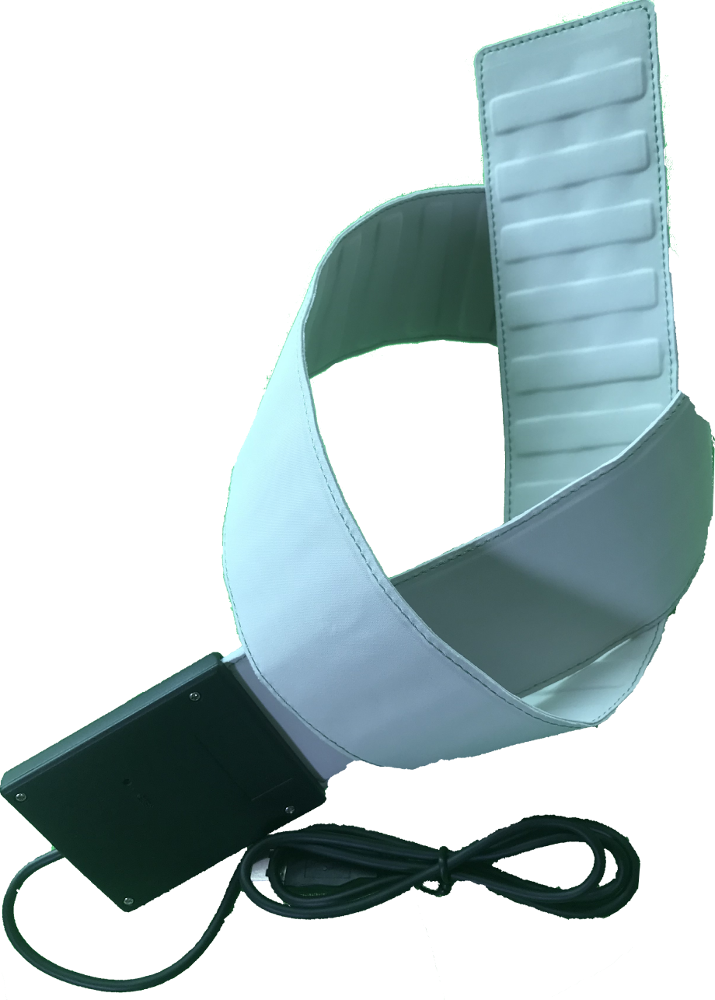
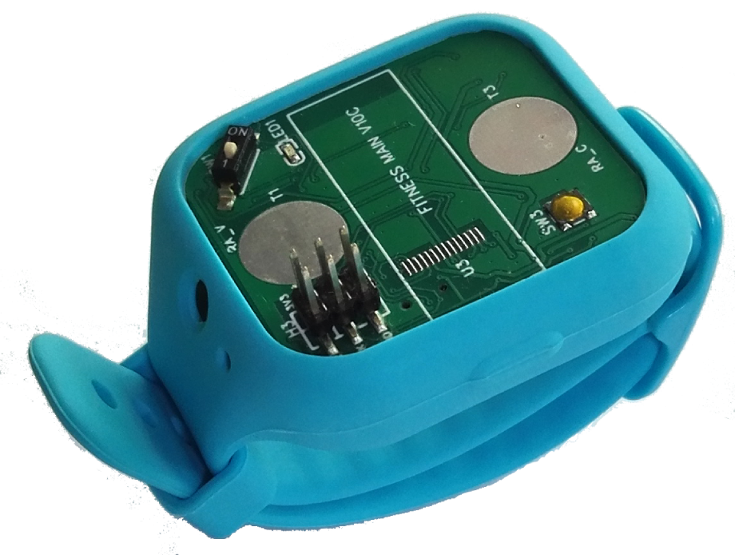

***********
Get Started
***********

This document is intended to help users set up the software environment for the development of healthcare applications using hardware based on the BioSensor-F58GM. Through a simple example, we would like to illustrate how to use BIO-HDF (BioSensor Healthcare Development Framework).

To make the start with BIO-HDF quicker, We designed development boards intended to build healthcare applications with the BioSensor. Click the links below to get started.

==========================================  ========================================== 
|Getting Started with Sleep-Strip|_         |Getting Started with Wristband-F58GM|_    
==========================================  ==========================================  
`Getting Started with Sleep-Strip`_         Coming soon ...     
==========================================  ==========================================  

.. _Getting Started with Sleep-Strip: get-started-esp32-sleep-strip-v01.html

.. _Getting Started with Wristband-F58GM: get-started-Wristband-F58GM.html

.. toctree::
    :hidden:
    :maxdepth: 1

    Guide for Sleep-Strip <get-started-Sleep-Strip>
    

If you do not have one of the above boards, you can still use BIO-HDF for the BioSensor based healthcare applications. This is providing your board has a compatible MCU or DSP chip, or you develop a driver to support communication with your specific chip.For the porting of drivers and algorithms, you can apply for technical support by email：fanfeiwu@gmail.com.

About BIO-HDF
=============

The BIO-HDF is available as a set of :hdf:`components` to extend the functionality already delivered by the `ESP-IDF <https://github.com/espressif/esp-idf>`_ (Espressif IoT Development Framework).

To use BIO-HDF you need set up the ESP-IDF first, and this is described in the next section.

.. note::

    BIO-HDF is developed using `stable version of ESP-IDF <https://docs.espressif.com/projects/esp-idf/en/stable/versions.html>`_. If your have already set up another version, please switch to the stable, or you may not be able to compile BIO-HDF applications.

.. _get-started-setup-esp-idf:

Set up ESP-IDF
==============

Configure your PC according to `ESP32 Documentation <https://docs.espressif.com/projects/esp-idf/en/stable/>`_. `Windows <https://docs.espressif.com/projects/esp-idf/en/stable/get-started/windows-setup.html>`_, `Linux <https://docs.espressif.com/projects/esp-idf/en/stable/get-started/linux-setup.html>`_ and `Mac OS <https://docs.espressif.com/projects/esp-idf/en/stable/get-started/macos-setup.html>`_ operating systems are supported.

You have a choice to compile and upload code to the ESP32 by command line with `make <https://docs.espressif.com/projects/esp-idf/en/stable/get-started/make-project.html>`_ or using `Eclipse IDE <https://docs.espressif.com/projects/esp-idf/en/stable/get-started/eclipse-setup.html>`_.

.. note::

    We are using ``~/esp`` directory to install the toolchain, ESP-IDF, BIO-HDF and sample applications. You can use a different directory, but need to adjust respective commands.

To make the installation easier and less prone to errors, use the ``~/esp`` default directory for the installation. Once you get through ESP-IDF setup and move to the BIO-HDF, you will notice that installation of the BIO-HDF follows the similar process. This should make it even easier to get up and running with the BIO-HDF.

If this is your first exposure to the ESP32 and `ESP-IDF <https://github.com/espressif/esp-idf>`_, then it is recommended to get familiar with :adf:`hello_world <esp-idf/examples/get-started/hello_world>` and :adf:`blink <esp-idf/examples/get-started/blink>` examples first. Once you can build, upload and run these two examples, then you are ready to proceed to the next section.

.. _get-started-get-esp-hdf:

Get BIO-HDF
===========

.. highlight:: bash

Having the ESP-IDF to compile, build and upload application for ESP32, you can now move to installing healthcare specific API / libraries. They are provided in `BIO-HDF repository <https://github.com/feelkit/bio-hdf>`_. To get it, open terminal, navigate to the directory to put the BIO-HDF, and clone it using ``git clone`` command::

    cd ~/esp
    git clone --recursive https://github.com/feelkit/bio-hdf.git

BIO-HDF will be downloaded into ``~/esp/bio-hdf``.

.. note::

    Do not miss the ``--recursive`` option. If you have already cloned BIO-HDF without this option, run another command to get all the submodules::

        cd ~/esp/bio-hdf
        git submodule update --init

.. _get-started-setup-path:

Setup Path to BIO-HDF
=====================

The toolchain programs access BIO-HDF using ``HDF_PATH`` environment variable. This variable should be set up on your PC, otherwise the projects will not build. The process to set it up is analogous to setting up the ``IDF_PATH`` variable, please see instructions in ESP-IDF documentation under `Add IDF_PATH to User Profile <https://docs.espressif.com/projects/esp-idf/en/stable/get-started/add-idf_path-to-profile.html>`_.

.. _get-started-start-project:

Start a Project
===============

After initial preparation you are ready to build the first healthcare application for the BioSensor. The process has already been described in ESP-IDF documentation. Now we would like to discuss again the key steps and show how the toolchain is able to access the BIO-HDF :hdf:`components` by using the ``HDF_PATH`` variable.

.. note::

    BIO-HDF is based on a specific release of the ESP-IDF. You will see this release cloned with BIO-HDF as a subdirectory, or more specifically as a submodule e.g. ``esp-idf @ ca3faa61`` visible on the GitHub. Just follow this instruction and the build scripts will automatically reach ESP-IDF from the submodule.

To demonstrate how to build an application, we will use :example:`get-started/health_piezo` project from :hdf:`examples` directory in the ADF.

Copy :example:`get-started/health_piezo` to ``~/esp`` directory::

    cd ~/esp
    cp -r $HDF_PATH/examples/get-started/health_piezo .

You can also find a range of example projects under the :adf:`examples` directory in the BIO-HDF repository. These example project directories can be copied in the same way as presented above, to begin your own projects.

.. _get-started-connect-configure:

Connect and Configure
=====================

Connect the healthcare ESP32 board to the PC, check under what serial port the board is visible and verify, if serial communication works as described in `ESP-IDF Documentation <https://docs.espressif.com/projects/esp-idf/en/stable/get-started/establish-serial-connection.html>`_.

At the terminal window, go to the directory of ``health_piezo`` application and configure it with ``menuconfig`` by selecting the serial port, upload speed and the healthcare board version::

    cd ~/esp/health_piezo
    idf.py menuconfig

Save the configuration.

.. _get-started-build-flash-monitor:

Build, Flash and Monitor
========================

Now you can build, upload and check the application. Run::

    idf.py flash 

This will build the application including ESP-IDF / BIO-HDF components, upload (flash) binaries to your ESP32 board and start the monitor.

Upload
------

.. highlight:: none

To upload the binaries, the board should be put into upload mode. To do so, hold down **Reset** button. The upload mode may be initiated anytime during the application build, but no later than "Connecting" message is being displayed::

    ...

    esptool.py v2.1
    Connecting........_____....

Without the upload mode enabled, after showing several ``....._____``, the connection will eventually time out.

Once build and upload is complete, you should see the following::

    ...

    Leaving...
    Hard resetting...
    MONITOR
    --- idf_monitor on /dev/ttyUSB0 115200 ---
    --- Quit: Ctrl+] | Menu: Ctrl+T | Help: Ctrl+T followed by Ctrl+H ---

Monitor
-------

Power on again to start the application. Following several lines of start up log, the ``health_piezo`` application specific messages should be displayed::

    ...

    I (1519) FeelKit_HUart: health_hw_uart_init  
       ...

    I (1699) FeelKit_TCP: Waiting for AP connection...
    I (1699) FeelKit_TCP: SYSTEM_EVENT_STA_START
    I (1709) FeelKit_Comm: The hal has been initialized!
    I (1709) BTDM_INIT: BT controller compile version [fd2a63b]
    I (1719) system_api: Base MAC address is not set, read default base MAC address from BLK0 of EFUSE
    I (1979) FeelKit_BLE: health_ble_init init bluetooth
    I (2069) FeelKit_BLE: EVT 0, gatts if 3
    I (2069) FeelKit_BLE: event = 0
    I (2069) FeelKit_BLE: gatts_profile_event_handler 385
    I (2079) FeelKit_BLE: gatts_profile_event_handler 388
    I (2079) FeelKit_BLE: gatts_profile_event_handler 391
    I (2089) FeelKit_Comm: The hal has been initialized!
    I (2159) FeelKit_Stream: sensor_status = 0x0
       ...

If there are no issues, besides the above log, you should find:"FeelKit_Stream: sensor_status = 0x0". if sensor_status != 0x0,then it is error.

Now you are ready to try some other :hdf:`examples`, or go right to developing your own applications. Check how the :hdf:`examples` are made aware of location of the BIO-HDF. Open the :example_file:`get-started/health_piezo/CMakeLists` and you should see ::

    cmake_minimum_required(VERSION 3.5)
    include($ENV{IDF_PATH}/tools/cmake/project.cmake)
    include($ENV{HDF_PATH}/CMakeLists.txt)
    project(health_piezo)

The third line contains ``$HDF_PATH`` to point the toolchain to the BIO-HDF. You need similar ``CMakeLists`` in your own applications developed with the BIO-HDF.

Update BIO-HDF
==============

After some time of using BIO-HDF, you may want to update it to take advantage of new features or bug fixes. The simplest way to do so is by deleting existing ``bio-hdf`` folder and cloning it again, which is same as when doing initial installation described in sections :ref:`get-started-get-bio-hdf`.

Another solution is to update only what has changed. This method is useful if you have a slow connection to the GitHub. To do the update run the following commands::

    cd ~/esp/bio-hdf
    git pull
    git submodule update --init --recursive

The ``git pull`` command is fetching and merging changes from BIO-HDF repository on GitHub. Then ``git submodule update --init --recursive`` is updating existing submodules or getting a fresh copy of new ones. On GitHub the submodules are represented as links to other repositories and require this additional command to get them onto your PC.

Related Documents
=================

.. toctree::
    :maxdepth: 1

    get-started-Sleep-Strip
    
